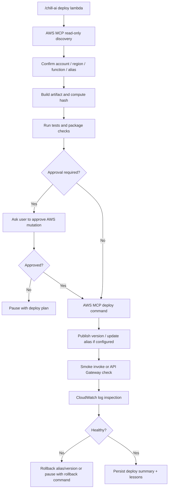

# AWS MCP Adapter

Use this adapter when `/chill-ai deploy` routes to the internal deploy stage for AWS resources such as Lambda, API Gateway, EventBridge Scheduler, CloudWatch Logs, S3, ECR, ECS, or IAM.

## Principle

AWS MCP is the deployment control plane for AWS targets. The workflow should use read-only discovery first, produce an explicit deployment plan, ask for approval when mutation is required, then execute the smallest safe AWS CLI operation through MCP.

Do not deploy to AWS from memory. Discover account, region, resource names, aliases, versions, schedules, log groups, and rollback options before proposing a command.

## MCP Tool Policy

- Use `call_aws` when the exact AWS CLI command is known.
- Use `suggest_aws_commands` only when the AWS service or operation is uncertain.
- Prefer batched read-only discovery commands when they are independent.
- Use `--region *` for account-wide regional discovery.
- Do not use shell pipes, redirection, command substitution, or environment-variable tricks in AWS MCP commands.
- Do not mutate production without explicit user approval.

## Read-Only Discovery

Start with these checks when relevant:

```text
aws sts get-caller-identity
aws lambda list-functions --region *
aws lambda get-function-configuration --function-name {name} --region {region}
aws lambda list-versions-by-function --function-name {name} --region {region}
aws lambda list-aliases --function-name {name} --region {region}
aws apigatewayv2 get-apis --region {region}
aws events list-rules --region {region}
aws scheduler list-schedules --region {region}
aws logs describe-log-groups --region {region}
```

## Mutation Approval Required

Ask before running any command that can change cloud state:

- Lambda create/update/delete function, version, alias, event source mapping, permission, or configuration.
- API Gateway create/update/delete route, integration, stage, deployment, or domain mapping.
- EventBridge rule or Scheduler create/update/delete/enable/disable.
- IAM role, policy, or permission changes.
- S3 object upload/delete for deploy artifacts.
- ECR image push/delete or ECS service update.
- Any production alias shift, traffic weighting, or rollback.

## Lambda Deployment Shape



## Deployment Report

Every AWS deployment plan or result should include:

- AWS account ID and ARN caller identity.
- Region.
- Target service and resource names.
- Resource ARN when available.
- Artifact path and hash when a build artifact exists.
- Exact AWS MCP command candidates.
- Approval status.
- Smoke test command/result.
- CloudWatch log group and latest error summary.
- Rollback command or manual rollback steps.

## Stop Conditions

Stop and ask the user when:

- AWS account ID is unexpected or undiscovered.
- Region is missing or ambiguous.
- Target Lambda/API/resource cannot be uniquely identified.
- Required IAM permission is missing.
- Production mutation lacks approval.
- Rollback target is unknown.
- Smoke test or CloudWatch checks fail.
