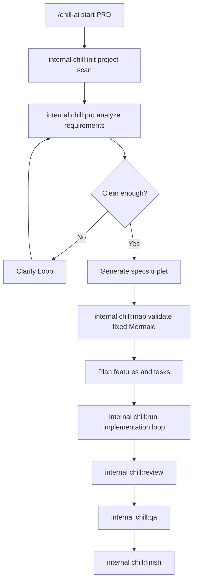

# /chill:from-prd

Main entry: turn a PRD into a project workflow and implementation loop.

## Usage

```text
/chill-ai start {prdPath} {projectPath}
/chill:from-prd {prdPath} {projectPath}
/chill:from-prd ./docs/prd.md ./apps/student-system
```

## Purpose

This is the top-level command. Use it when starting from a PRD and wanting the workflow to create or evolve a complete project.

## Orchestrator Responsibility

This internal stage owns the full workflow after `/chill-ai start` routes here. It must not return after specs or diagrams and ask the user to manually run another stage.

After each normal phase, load the next command file and execute it inline:

```text
chill:init -> chill:prd -> chill:map -> chill:run -> chill:review -> chill:qa -> chill:finish
```

Use `.chill/orchestrator.md` for the Kiro-inspired phase contract.

## Workflow

1. Run Project Scan.
   - If `projectPath` exists, scan it.
   - If `projectPath` does not exist, create a project plan first and ask before scaffolding.
2. Run PRD Analysis.
   - Read `prdPath`.
   - Extract product goal, roles, modules, acceptance criteria, constraints, and risks.
3. Enter Clarify Loop if critical product details are missing.
4. Generate Specs.
   - `requirements.md`
   - `design.md`
   - `tasks.md`
5. Install and validate standard Mermaid maps.
   - Copy the fixed Chill diagrams from `.chill/diagrams/`.
   - Do not redesign the core workflow diagrams from the PRD.
   - Use PRD analysis to create specs, task plans, state, and context.
   - Only create a project-specific execution snapshot when it helps explain the current feature/task plan.
6. Persist workflow state.
   - `.chill/state/workflow-state.json`
   - `.chill/state/audit-log.jsonl`
7. Continue automatically into implementation planning unless a gate pause is required.

## Default Behavior: continue automatically

After project scan, PRD analysis, specs generation, and Mermaid validation, continue to internal `chill:run` by loading `.chill/internal/commands/chill:run.md` and executing it inline. Do not stop to ask whether the user wants the next normal stage.

Pause only when:

- The PRD lacks acceptance criteria or business rules that change implementation.
- A new project scaffold would overwrite existing files.
- Stack choice would materially change architecture and cannot be inferred.
- Auth, payment, privacy, production deployment, external credentials, or cloud mutation requires approval.

If paused, write state and show:

```text
Chill paused at gate: {gateId}
Reason: {reason}
Resume: /chill-ai continue
Approve if appropriate: /chill-ai approve {gateId}
```

## Stack Choice Gate

If the target project has no application stack or source layout, pause with `stack-choice-001` and include exactly three recommended choices plus a custom option.

Default option set for a typical web product:

1. `Next.js + TypeScript + SQLite/Postgres + Prisma` - best for full-stack MVP with strong UI and API speed - tradeoff: Node-centric backend.
2. `React/Vite + FastAPI + Postgres` - best for clearer frontend/backend separation and Python-friendly AI/data work - tradeoff: two app runtimes.
3. `React/Vite + Hono/Node + SQLite/Postgres` - best for lightweight serverless or edge-friendly APIs - tradeoff: fewer batteries included.
4. `Custom` - user supplies preferred stack.

The gate output must include a clear recommendation based on the PRD and deployment expectation. Do not ask an open-ended "what stack do you want?" unless the three defaults do not fit the product.

## Implementation Workflow

1. Plan Implementation.
   - Split features.
   - Keep each feature near 10 to 15 tasks.
   - Decide serial versus parallel execution.
2. Execute Tasks.
   - Dispatch subagents only for independent task boundaries.
   - Merge results.
3. Run Gates.
   - internal `chill:review`
   - internal `chill:qa`
4. Finish.
   - Mark tasks complete.
   - Write lessons.
   - Sync docs.
   - Produce handoff summary.

## Mermaid



## Output

- Project workflow profile.
- Specs triplet.
- Standard Chill Mermaid diagrams used as workflow source of truth.
- Optional project execution snapshot if useful.
- Implementation task plan.
- Review/QA report.
- Final handoff.

## Completion Behavior

- If no gate is blocked, continue into internal `chill:run`.
- If implementation was also executed, report review and QA status and continue to the next task or internal `chill:finish`.
- Never silently stop without writing state, reporting a gate, or completing the workflow.

## Stop Conditions

- The PRD is too vague to produce acceptance criteria.
- The project stack cannot be inferred and multiple choices would change the architecture.
- Scaffolding a new project would overwrite existing files.
- Credentials are required for deployment, payment, auth, or external APIs.
