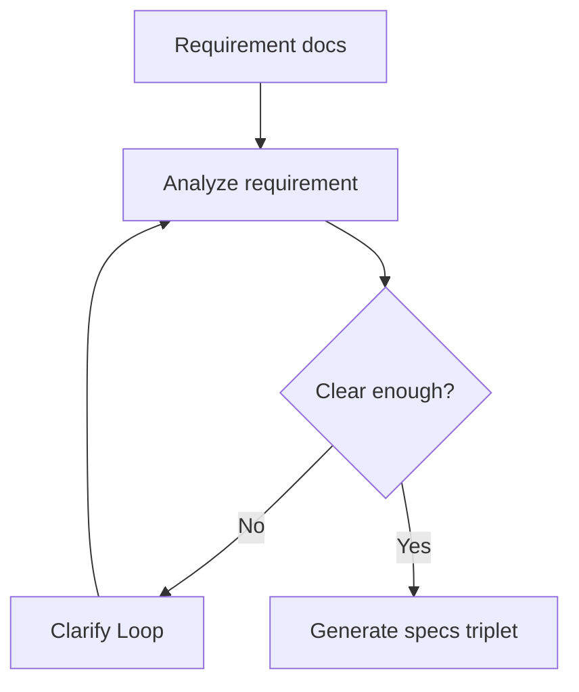

# /chill:prd

Convert requirement documents into executable specs.

## Usage

```text
/chill:prd {docsPath}
```

## Workflow

1. Read all requirement sources from `docsPath`.
2. Load project profile from `.chill/CHILL.md`.
3. Extract goals, users, user stories, constraints, dependencies, and acceptance criteria.
4. Enter Clarify Loop if business rules, permissions, payment, data privacy, or acceptance criteria are missing.
5. Generate a numbered feature directory under `specs/`.
6. Write `requirements.md`, `design.md`, and `tasks.md`.
7. Keep each feature small enough for execution; split when tasks exceed about 15 items.

## Output

```text
specs/{N}.{feature-name}/
├── requirements.md
├── design.md
└── tasks.md
```

## Mermaid



## Continuation

After specs are generated, continue automatically to internal `chill:map`, then internal `chill:run`, unless a clarify gate is blocked.
