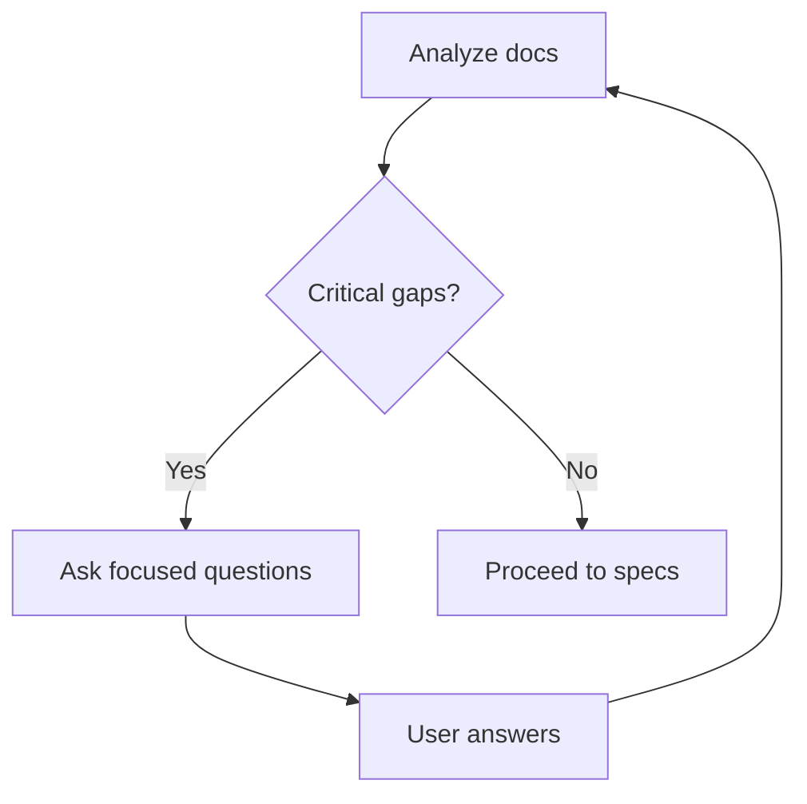

# N2: Requirement Clarify

Purpose: prevent unclear requirements from becoming fake certainty.

## Clarify When

- Business flow has multiple valid interpretations.
- Role, permission, payment, privacy, or data retention is unclear.
- Acceptance criteria are missing.
- External service behavior is assumed but not specified.

## Loop

