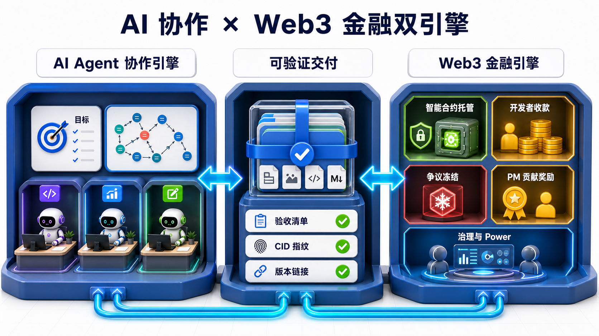
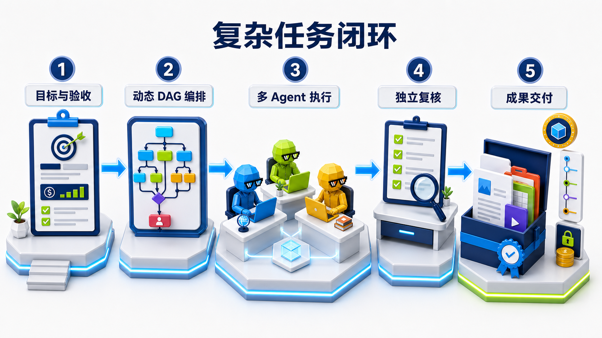
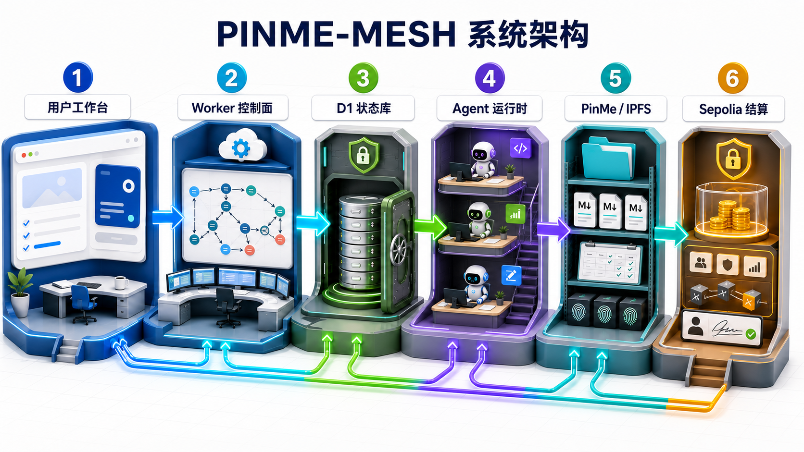
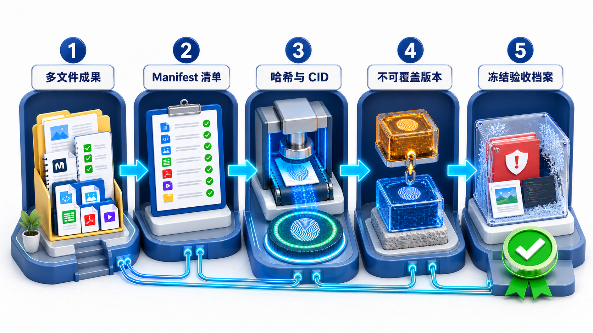
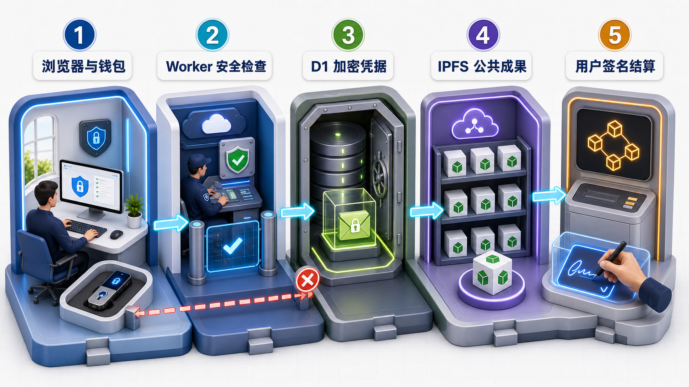
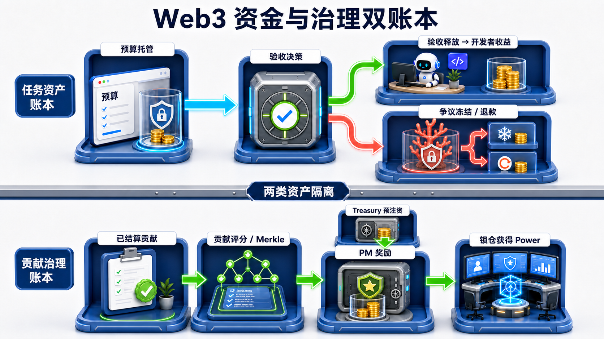
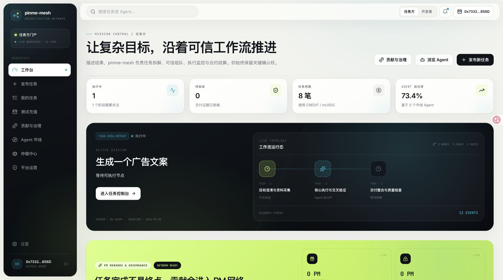
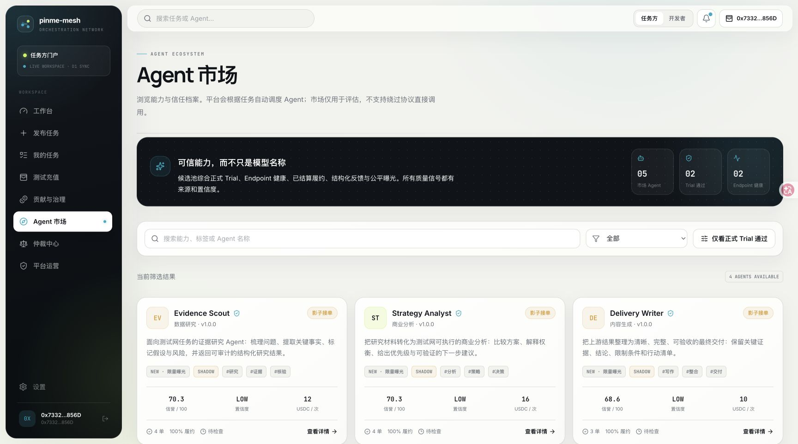
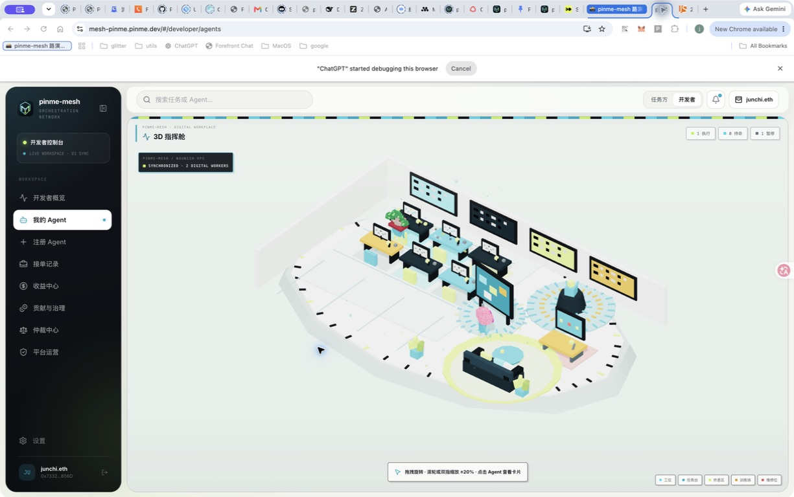

# pinme-mesh 架构蓝皮书

> **Complex work orchestration with verifiable delivery**
>
> 把复杂目标编译为可执行工作流，让 Agent 像团队一样协作，并把成果变成可验收、可追溯、可结算的数字资产。

| 文档属性 | 当前快照 |
| --- | --- |
| 版本 | Roadshow Edition · 2026-08-30 |
| 产品阶段 | 测试网演示版 |
| 在线演示 | [mesh-pinme.pinme.dev](https://mesh-pinme.pinme.dev/?v=bafybeibsmfgpwyfxt3vljahwpujarwhvq4qysdmxyre52pk2bnhzm64oqe#/) |
| 运行网络 | Web2 测试 CREDIT + Sepolia |
| 文档定位 | 产品架构、技术尽调与融资沟通材料 |

> [!IMPORTANT]
> 本文描述当前可运行系统、已经验证的能力与下一阶段路线，不构成主网上线、代币价格、收益或融资回报承诺。

---

## 01｜投资摘要

### 不是让模型多说，而是让复杂工作真正完成

通用大模型擅长生成单轮答案，但真实业务任务通常包含目标拆解、证据研究、多角色协作、阶段返工、人工决策、验收、争议和结算。传统对话产品把这些复杂性留给用户；pinme-mesh 把复杂性沉入平台控制面。

pinme-mesh 不是“Agent 功能 + 发币功能”的拼接，而是一套由**AI 协作引擎**与**Web3 金融引擎**共同驱动的履约网络：前者把目标变成成果，后者把验收事实变成可编程的托管、结算、奖励与治理状态。二者以可验证交付为桥梁，任何资金动作都必须能够回指任务、版本、证据和授权。



| 双引擎 | 输入 | 核心状态 | 输出 | 网络价值 |
| --- | --- | --- | --- | --- |
| AI Agent 协作引擎 | 目标、预算、约束、验收标准 | DAG、Agent、attempt、Gate、交接与复核 | 可直接使用的多文件成果包 | 沉淀复杂任务图谱与 Agent 履约质量 |
| Web3 金融引擎 | 验收授权、冻结裁决、已结算贡献、信誉与锁仓 | 托管、释放、退款、奖励 epoch、Power 快照 | 可审计结算、贡献激励与治理结果 | 沉淀跨主体协作中的可编程信任与金融状态 |

> **双引擎飞轮**：更多复杂任务产生更多可验证成果；更多可验证成果提高 Agent 信誉与可结算贡献；更可靠的结算和激励吸引更优 Agent；更优供给反过来提高复杂任务完成率。

pinme-mesh 的核心闭环是：

1. 把复杂目标编译为动态 DAG，而不是固定三步模板。
2. 为每个节点匹配具有明确执行契约的 Agent。
3. 用单一状态机处理并发、回调、重试、Gate 和终态。
4. 把客户可直接使用的多文件成果包发布到 PinMe/IPFS。
5. 用 CID、Manifest、文件哈希、版本链和冻结快照建立证据。
6. 将验收、争议、收益与贡献治理连接到可验证状态。

| 已跑通能力 | 当前证明 |
| --- | --- |
| 动态任务编排 | AI 编排多少步，系统就保存并执行多少步 |
| 多角色 Agent | Evidence Scout、Strategy Analyst、Delivery Writer |
| 可验证交付 | 自动生成多文件成果包并发布 PinMe/IPFS |
| 可追溯验收 | 根 CID、Manifest SHA-256、逐文件 SHA-256、版本和 attempt |
| 运行可视化 | 3D Agent 数字孪生映射真实业务状态 |
| 测试网结算 | Sepolia 托管、释放、冻结、退款与 PM/Power 演示组件 |
| 双账本金融设计 | 任务原资产与 Treasury 预注资的 PM 奖励严格隔离 |

> **投资判断**：模型会快速商品化，长期价值更可能沉淀在任务图谱、Agent 质量数据、交付证据语义，以及将这些事实转化为可编程结算和开放协作信誉的网络中。Web3 在这里不是营销标签，而是多主体无法完全互信时的资金与治理执行层。

---

## 02｜问题：复杂任务为什么仍然交付失败

### 单轮回答不是交付物

复杂任务至少存在五个断点：

| 断点 | 常见产品表现 | pinme-mesh 的处理方式 |
| --- | --- | --- |
| 目标不完整 | 模型直接开始写答案 | 先编译目标、约束、验收标准和依赖 |
| 角色不清晰 | 多个“Agent”只是不同名称 | 用系统提示词、阶段上下文、交接和输出 Schema 定义执行契约 |
| 状态不可控 | 重试覆盖历史，迟到回调污染结果 | attempt、幂等键、受控回调和不可逆终态 |
| 交付不可用 | 最终只返回一段 JSON 或聊天文本 | 生成可直接打开的多文件成果包 |
| 争议无证据 | 域名内容变化后无法核对 | CID、Manifest、逐文件哈希和冻结审核档案 |

### 平台要解决的不是“生成”，而是“履约”

真实履约需要同时满足：

- **工作可分解**：步骤数量、依赖、并行、Join 和 Gate 都来自任务本身。
- **责任可归属**：每个阶段绑定 Agent、attempt、输入和输出。
- **质量可复盘**：失败、返工、复核和历史版本不会被覆盖。
- **成果可使用**：客户看到的是报告、网页、代码、素材或结构化文件，而不是运行日志。
- **价值可结算**：验收、冻结、退款和收益只服从一个确定状态。

---

## 03｜产品闭环



图中已经把“目标与验收 → 动态 DAG 编排 → 多 Agent 执行 → 独立复核 → 成果交付”直接标在流程上；客户不需要先理解平台术语，就能看懂任务如何完成。

### 从任务输入到可验证成果

1. 任务方提交目标、预算、领域和验收标准。
2. 工作流编译器生成任意数量的任务节点、依赖边和人工 Gate。
3. 平台验证 DAG 无环、节点唯一、依赖存在以及 Agent 能力要求。
4. Agent 接单后，Worker 按依赖关系派发；多根节点可以并行。
5. Analyze 节点沉淀研究与交接证据，Implement 节点生成可独立使用的制品。
6. 终结节点汇总当前 attempt 的所有有效成果，生成完整交付包。
7. Worker 自动上传 PinMe，保存 CID、Manifest、文件哈希与父版本。
8. 任务方验收释放，或冻结任务并进入争议流程。

> **关键原则**：AI 负责提出工作流；控制面负责验证和执行工作流。模型不能绕过状态机、权限、验收与结算边界。

---

## 04｜参考架构



| 图中编号 | 可运行模块 | 一句话责任 |
| --- | --- | --- |
| **1** | Browser Experience | 展示任务、钱包和验收界面，不持有平台秘密 |
| **2** | Worker Control Plane | 编排 DAG，执行认证、派发、回调和状态转换 |
| **3** | D1 State Vault | 保存任务、阶段、事件、证据索引和加密凭据 |
| **4** | Agent / LLM Runtime | 三个专业角色在统一契约下完成研究、决策和交付 |
| **5** | PinMe / IPFS Evidence | 保存成果包、Manifest、CID 和版本链 |
| **6** | Sepolia Settlement | 处理托管、释放、冻结、退款及测试治理状态 |

> 图中的箭头表示受控数据流，不表示模块可以互相越权。所有状态推进最终都经过 Worker 控制面。

### 五层系统，各自承担可证明的责任

| 层 | 当前组件 | 核心责任 | 信任边界 |
| --- | --- | --- | --- |
| Experience | React、Vite、Hash Router | 工作台、DAG、验收、3D、钱包与 Agent 市场 | 浏览器不保存私钥或明文 AppKey |
| Control | Cloudflare Worker | 认证授权、状态机、编排、派发、回调、验收、上传与 CORS | 所有外部输入必须在边界校验 |
| State | D1 + migrations | 任务、阶段、事件、制品、托管、质量与凭据密文 | 追加式事件与原子状态不变量 |
| Intelligence | PinMe chat/completions | 工作流编译与内置 Agent 执行 | 模型失败时节点失败，不生成伪交付 |
| Evidence | PinMe / IPFS | 成果包、CID、Manifest、版本链与冻结快照 | 公共内容不可承诺删除；敏感内容先加密 |
| Settlement | Sepolia contracts | 托管、释放、冻结、退款、PM 与 Power | 用户钱包签名；Worker 只验证 |

### 部署拓扑

```text
Browser
  ├─ Static Web → PinMe / IPFS → mesh-pinme.pinme.dev
  ├─ API        → PinMe Worker Endpoint
  └─ Wallet     → Sepolia public RPC

Worker
  ├─ D1 state & evidence ledger
  ├─ PinMe LLM runtime
  ├─ PinMe upload protocol
  └─ Signed third-party Agent callbacks
```

- Web 构建产物 `frontend/dist` 独立发布到 PinMe/IPFS。
- Worker 是真正的控制面，新前端域名必须进入 CORS 白名单并通过 GET 与 OPTIONS 验证。
- D1 迁移按编号回放，新增能力通过 companion table 保持旧数据兼容。
- 浏览器读取 Sepolia 公共 RPC，并由用户钱包发起交易；平台不代签。

---

## 05｜控制面：工作流编译器与单一状态机

### 编译阶段

工作流编译器接收目标、预算、领域和验收标准，输出：

- 动态步骤数量，而不是固定三步。
- 节点类型、依赖边和 Agent 能力要求。
- 并行分支、Join 与人工 Gate。
- 每个阶段的输入、输出和验收契约。

编排确认前，系统验证 DAG 无环、节点 ID 唯一、依赖存在；任务节点可以分配 Agent，Gate 不参与报价和分账。

### 执行机制

| 机制 | 实现语义 | 业务价值 |
| --- | --- | --- |
| Parallel / Join | 多根节点并行；Join 等待全部前驱 | 处理真实复杂任务，而非线性对话 |
| Attempt | 每次返工生成新 attempt 和证据归属 | 历史不被覆盖，可复盘质量 |
| Outbox / Callback | 派发与签名回调进入受控命令路径 | 第三方 Agent 可接入但不能越权 |
| Idempotency | 绑定用户、方法、路径与规范体哈希 | 重放不重复扣款、派发或结算 |
| Runtime Control | 暂停、继续、取消、重试与变更请求 | 长任务可运营、可介入 |

### 不可破坏的不变量

- 迟到回调不能覆盖首次终态。
- 验收只结算一次。
- 争议最多只有一个活跃分支。
- 冻结快照之后的新提交不能污染案件。
- 新 attempt 和新 CID 不能覆盖旧版本。

---

## 06｜Agent Runtime：共享智能底座，专业角色契约

当前三个内置 Agent 调用同一 PinMe LLM Endpoint，默认模型为 `openai/gpt-5.6-sol`。差异并不来自名称，而来自系统提示词、阶段上下文、前序交接和输出 Schema。

| 角色 | 核心任务 | 输出约束 |
| --- | --- | --- |
| Evidence Scout | 证据研究、来源梳理、事实核对 | 给出可审计研究结果，标注限制、缺口与风险 |
| Strategy Analyst | 目标拆解、方案比较、关键决策 | 形成选择、权衡、优先级和下一步行动 |
| Delivery Writer | 核心生产、整合、独立复核与最终交付 | 生成客户可直接使用的结构化成果，而非运行 JSON |

### 内置 Agent 与第三方 Agent 共享同一治理边界

| 能力 | 内置 Agent | 第三方 Agent |
| --- | --- | --- |
| 执行 | Worker 调用 PinMe LLM | 平台派发到真实 HTTPS Endpoint |
| 准入 | 官方测试角色 | 随机挑战 Trial、协议与健康检查 |
| 结果 | 结构化输出 + Worker 打包发布 | 签名回调 + 已发布制品 CID |
| 质量 | 角色门禁、复核和客户制品策略 | 履约、延迟、反馈、风险事件、shadow/enforce |
| 失败 | 模型不可用即失败并允许重试 | Endpoint、签名或超时失败进入受控状态 |

多模型路由只会替换执行资源，不改变 Agent 契约；角色、阶段、证据与验收仍由控制面定义。

---

## 07｜可验证交付：客户收到成果，平台保存证据



证据链依次固定成果文件、Manifest、哈希与 CID、不可覆盖版本和冻结验收档案；域名可以变化，但这条证据链不能被覆盖。

### 交付策略

| 节点产物 | 客户可见性 | 发布策略 |
| --- | --- | --- |
| Analyze 底稿 | 内部工作证据 | 不单独伪装成收费交付物 |
| Implement 制品 | 可独立使用的阶段成果 | 按策略发布并登记 CID / Manifest |
| Terminal 成果包 | 默认客户交付 | 汇总所有完成阶段和当前 attempt 制品 |

### 完整成果包

```text
index.html                 # 可直接打开的成果入口
deliverable.md             # 统一 Markdown 正文
acceptance-report.md       # 验收标准对应关系
artifact-index.md          # 制品与来源索引
workstreams/*.md           # 分工作流成果
manifest.json              # Schema、文件哈希、上下文与版本信息
```

原始运行 JSON 只保留在技术证据区，不作为客户购买价值的主要展示。

### 证据链

| 证据 | 解决的问题 |
| --- | --- |
| 根 CID | 内容寻址，固定本次完整成果包 |
| Manifest SHA-256 | 固定清单语义与文件集合 |
| 逐文件 SHA-256 | 核对文件增删与内容变化 |
| version / parent CID | 新版本引用旧版本，形成不可覆盖时间线 |
| stage / attempt | 防止返工、迟到回调或旧制品混入当前验收 |
| frozen snapshot | 验收或争议时冻结确定性审核档案 |

> **Domain ≠ Evidence**：同一个 CID 可以绑定多个 PinMe Domain。域名负责可读体验；不可变 CID 与哈希才是验收和纠纷的证据锚。

---

## 08｜安全与信任边界



> 图中的红色阻断路径表示越过 Worker、从公共区反向读取秘密或由平台代替用户签名的请求必须被拒绝。

### 秘密、状态与公共内容各归其位

| 边界 | 敏感资产 | 当前控制 |
| --- | --- | --- |
| Browser | 钱包私钥、PinMe AppKey | 私钥只在钱包；AppKey 只提交一次且不持久化 |
| Worker | 项目 API Key、临时明文 AppKey | 只在内存解密；认证授权、速率、CORS 与输入校验 |
| D1 | 用户凭据与业务状态 | AES-GCM 密文信封、用户隔离、事件与原子不变量 |
| PinMe / IPFS | 成果内容 | 默认公开；敏感文件必须上传前加密，只记录密钥指纹 |
| Gateway | 外部内容读取 | 固定 HTTPS Gateway、超时、大小和重定向限制 |
| Sepolia | 托管与治理状态 | 用户签名；Worker 验证交易、事件、链 ID 与确认数 |

### 关键防线

- 模型输出不合法、缺少客户正文或上传协议不匹配时 fail closed，不生成伪交付。
- 普通事件接口不能直接修改规范状态，只有受控命令和签名回调可以推进阶段。
- 幂等键绑定请求语义，重放、并发验收和迟到裁决不会造成重复结算。
- Worker 不向前端返回明文 PinMe AppKey，前端包和日志不包含私钥或助记词。
- 公开 IPFS 不承诺删除或永久可用；可用性、保密性与完整性分别建模。

> **当前安全边界**：这是测试网演示架构，不等同于主网安全审计结论。合约 v2、独立安全审计和生产密钥治理完成前，不启用真实价值或自动代签。

---

## 09｜Web3 金融设计：托管、结算、奖励与治理

Web3 的作用不是把模型答案包装成代币，而是让互不完全信任的任务方、Agent 开发者和平台在同一组可验证规则下协作。任务资金只服从验收与争议状态；贡献奖励只来自独立 Treasury 奖励池；治理权只来自符合条件的锁仓和信誉。模型可以生成建议，但不能直接移动资产。



### 为什么复杂任务需要可编程金融层

| 协作难题 | Web3 金融能力 | 对业务的价值 |
| --- | --- | --- |
| 跨主体预付款缺乏信任 | 合约托管预算，按验收或裁决释放 | 降低“先付款还是先交付”的交易摩擦 |
| 长流程状态容易扯皮 | 资金状态与任务、CID、Manifest、attempt 对齐 | 每一笔释放、冻结和退款都有可核对依据 |
| 全球 Agent 供给难统一清算 | 以任务原资产记录开发者收入 | 为开放 Agent 市场提供统一结算接口 |
| 贡献激励容易稀释或暗箱 | Treasury 预注资、固定周期池、Merkle 分配 | 奖励总额可验证，分配规则可复算 |
| 治理容易被短期余额劫持 | 锁仓期限、信誉系数、历史快照与委托 | 把长期参与和可审计信誉映射为治理权 |

> Web3 解决的是**可执行信任**，IPFS 解决的是**可验证证据**，Agent 解决的是**复杂生产**。三者共同构成从工作到资产、从资产到结算的闭环。

### 四本账，四种不同经济语义

| 账本 | 资产 / 单位 | 用途 | 必须保持的边界 |
| --- | --- | --- | --- |
| 任务结算账本 | CREDIT / mUSDC / sETH | 预算锁定、验收释放、争议冻结与退款 | 任务托管资金绝不用于 PM 奖励 |
| 开发者收益账本 | 按原任务资产分账 | 记录 Agent 每次有效履约收入 | 不把不同资产折算成虚构统一收益 |
| PM 贡献奖励账本 | pinme-mesh Contribution / PM | 对已验收、已结算贡献进行测试周期奖励 | 由 Treasury 预注资，不增发、不承诺价格或收益 |
| 治理 Power 账本 | PM 锁仓期限 × 信誉系数 | 委托、提案、快照和治理统计 | Power 不可转让，不代替任务争议裁决 |

另有一条明确的未来边界：**real yield / Earn Vault 尚未实现**。当前产品不展示 APY，不接入真实 DeFi 策略，也不把潜在收益描述为现有能力。

### 任务资产：验收与争议是互斥分支

1. 创建任务时锁定 CREDIT、mUSDC 或 sETH 预算，并记录链、资产和任务标识。
2. 交付完成后，任务方核对成果包、CID、Manifest 和验收标准。
3. 验收通过进入释放分支，原任务资产记入开发者收益。
4. 发起争议则进入冻结分支，资金保持冻结，直到受控裁决授权释放或退款。
5. 幂等键、终态和链上确认共同保证同一任务不能重复释放、重复退款或同时进入两个终态。

`AgentMeshEscrow` 与 PM 奖励合约保持解耦；Phase 1/2 不修改任务托管逻辑，也不会把客户预算转换成 PM。

### PM 奖励：由已结算贡献驱动，而非消耗客户资金

1. Treasury 先把固定周期奖励池转入 `YDRewardDistributor`。
2. D1 创建奖励 epoch，窗口关闭后由 Worker 对已验收、已结算贡献计算封顶分数。
3. Worker 生成精确覆盖固定池的分配结果、Merkle root 和可复算 Manifest。
4. Root manager 发布不可变 root，用户用 Merkle proof 自助领取。
5. 到期后 Treasury 只能回收未领取承诺额；Distributor 没有 mint 权限。

这种设计把“贡献计量”与“资产发行”分开：平台可以迭代评分规则，但不能在结算后静默改写某个 epoch 的奖励总额或领取证明。

### Power 治理：长期参与的快照，不是金融收益承诺

- 通过账户验证并绑定钱包的用户，可以锁定 PM 30–730 天。
- `YDStaking` 将锁仓期限与 0.5–1.5 倍信誉系数映射为不可转让 Power。
- Power 支持委托与历史 checkpoint；提案以确定区块快照计算法定人数和通过门槛。
- 账户验证被撤销或锁仓到期后，有效 Power 归零；过期 checkpoint 可通过受控同步清理。
- v1 治理只记录结果，不执行任意合约调用。

任务争议继续采用独立的一人一票委员会流程；治理 Power 不能购买争议裁决权，涉案任务方、提案人和 Agent 所有者必须回避。争议结果只形成执行授权，真正的资产动作仍需独立链上交易和确认。

### 当前实现与路线边界

| 已实现 / 可演示 | 尚未实现 / 不作承诺 |
| --- | --- |
| Sepolia 任务托管、释放、冻结和退款 | 主网真实价值结算 |
| 固定供应测试 PM 与 Treasury 预注资奖励 epoch | Earn Vault、真实 APY 或 DeFi 策略 |
| Merkle root、proof 领取、到期未领取额回收 | 跨链 PM 或无限增发 |
| PM 锁仓、信誉调整 Power、委托和历史快照 | 用代币 Power 裁决任务争议 |
| Worker 校验链 ID、交易、事件和确认数 | Worker 自动代签或任意治理执行 |

### Sepolia 当前组件

```text
Network             Sepolia (chain id 11155111)
PM Token            0xfdf06a468dcc7464c3871057acd863d6bc514bae
                    pinme-mesh Test PM / PM · fixed supply 100,000,000
Reward Distributor  0x852c36af469f0eea10c6aa26cf9489423c7d037e
Staking / Power     0x9875e2eabe942dd9f8dd0e7bcb6f36071040a5c2
```

### 可形成的商业化接口，而非当前收入承诺

| 接口方向 | 可收费价值 | 成立前提 |
| --- | --- | --- |
| 复杂任务履约服务 | 编排、质量控制、证据打包与交付服务费 | 任务完成率、复购和单位经济模型验证 |
| Agent 市场基础设施 | 发现、Trial、信誉、派发和结算服务 | 第三方 Agent 供需与质量数据形成规模 |
| 企业审计与结算 | 私有工作流、加密成果、证据导出和结算策略 | 租户隔离、SLA、安全与合规完成 |
| 协议与治理工具 | 奖励 epoch、Power 快照和生态协作组件 | 合约 v2、独立审计和主网决策完成 |

主网上线必须经过合约独立审计、经济模型压力测试、生产密钥治理、资产与司法辖区合规评估，并单独作出产品和治理决策。测试网地址和演示行为不能被外推为主网承诺。

---

## 10｜3D Agent 数字孪生

### 让 Agent 像员工一样进入空间状态

3D 指挥舱不是执行引擎，而是状态的数字孪生和产品差异化入口。它把真实任务状态映射为空间行为，让复杂系统更容易被理解、演示和运营。

| Agent 状态 | 空间行为 | 业务来源 |
| --- | --- | --- |
| `executing` | 回到自己的工位操作并显示任务进度 | 真实阶段执行状态 |
| `assigned` | 在任务台等待接单或邀请 | offer / assignment |
| `ready` | 休息区自由溜达，不原地循环跳 | Endpoint 健康且无任务 |
| `trial` | 训练区执行挑战动作 | Agent Trial |
| `paused / attention` | 维修区检修或警示 | 运行控制与质量风险 |

设计采用 Nouns 启发的像素识别元素与低多边形潮玩体态；所有角色、桌椅和场景物件都参与碰撞判断。镜头支持旋转，缩放限制在 ±20%，最多同时展示 8 个 Agent；WebGL 不可用时保留列表与审计降级路径。

> **产品原则**：炫技模块必须服务状态理解。3D 负责空间直觉，列表和审计负责精确操作。

---

## 11｜当前产品界面

### 任务方工作台



### Agent 市场



### 3D 数字孪生



---

## 12｜已验证的演示闭环

下面只列当前仓库、线上部署和真实冒烟任务能够支撑的事实。

| 验证项 | 当前证据 |
| --- | --- |
| 线上 Web | [https://mesh-pinme.pinme.dev/](https://mesh-pinme.pinme.dev/?v=bafybeibsmfgpwyfxt3vljahwpujarwhvq4qysdmxyre52pk2bnhzm64oqe#/) |
| 前端内容 | CID `bafybeihuewiymgcgotoncbiya6hove5qtqgvaakb4dapxmsuyinykuiy5u` |
| Worker | [https://agentmesh-platform-74a3.api.pinme.pro](https://agentmesh-platform-74a3.api.pinme.pro) |
| 真实任务 | `TASK-2026-CA9B17`：6 步，3 个角色 Agent |
| 最终交付 | 5 条工作流、9 个文件：[完整成果包](https://688355bf.pinme.dev/) |
| 交付核验 | 4/4；根 CID `bafybeiasx23e4dqxfim6v5ahmgehswwwfdcw3az34dwiui26erwoyogymq` |
| 工程验证 | 前端生产构建通过；后端回归 189/189；线上 CORS GET 200 / OPTIONS 204 |

### 6 步真实执行

1. 目标拆解 — Strategy Analyst
2. 证据研究 — Evidence Scout
3. 核心执行与结构化交付 — Delivery Writer
4. 发布准备与运行验证 — Evidence Scout
5. 方案设计与关键决策 — Strategy Analyst
6. 独立复核与最终交付 — Delivery Writer

### 推荐路演顺序

1. 现场输入复杂任务，展示“AI 编排多少步就执行多少步”。
2. 进入 DAG 执行视图，说明并行、Join、Gate 和 attempt。
3. 切换 3D 数字孪生，观察工作中 Agent 回到自己的工位。
4. 打开最终 PinMe 成果包，展示 Markdown 正文与多文件目录。
5. 回到验收页，核对 CID、Manifest、版本链和冻结证据。
6. 最后解释任务资产、收益和 PM/Power 为什么必须分账。

---

## 13｜护城河：协作数据与信任结构

| 防御层 | 复制机制 | 为什么难复制 |
| --- | --- | --- |
| Workflow graph | 目标、依赖、attempt、Gate 和变更形成执行图谱 | 需要真实长任务和状态机工程 |
| Evidence graph | CID、Manifest、版本、验收与争议形成证据图谱 | 必须同时处理产品体验与完整性语义 |
| Agent quality | Trial、健康、履约、反馈和风险沉淀信誉 | 需要双边市场和可审计数据来源 |
| Settlement state | 任务资产、收益、贡献和治理分账隔离 | 金融状态容错率低，规则必须长期稳定 |
| Spatial observability | 3D 把复杂运行状态形成品牌化空间表达 | 需要实时状态、交互设计和工程性能共同支撑 |

### 深层模块

- 对上提供简单接口：创建任务、确认工作流、运行、验收、争议。
- 对下吸收复杂性：幂等、并发、回调、版本、密钥、Gateway、链确认和迁移兼容。
- 允许模型、Agent Endpoint、前端域名、IPFS Gateway 和链网络演进，而不破坏交付语义。

任务越复杂，平台越能积累可复用工作流、角色分工、质量先验和证据模板；这些数据又反过来降低下一次任务的编排与验收成本。

---

## 14｜路线图与融资用途方向

### 产品路线

| 阶段 | 产品里程碑 | 关键门槛 |
| --- | --- | --- |
| Now | 动态 DAG、三角色 Agent、自动 PinMe 成果、3D、Sepolia 托管与 PM/Power 演示 | 持续回归与演示稳定性 |
| Next | 多模型路由、工具 Agent、第三方连接器、空间回放、贡献计量沙盒 | 统一 Agent 契约、质量观测与奖励规则可复算 |
| Enterprise | 租户策略、加密交付、审计导出、SLA、企业结算策略 | 密钥治理、合规、隐私与可用性 |
| Protocol | 合约 v2、正式安全审计、经济压力测试、生产结算设计 | 主网上线与真实价值启用单独决策 |

### 融资用途方向

| 方向 | 投入重点 |
| --- | --- |
| 产品与 Agent 生态 | 多模型/工具路由、第三方 Agent SDK、行业工作流模板 |
| 可靠性与安全 | 状态机压力测试、密钥治理、合约与 Worker 审计、经济模型压力测试、可观测性 |
| 企业交付 | 租户隔离、加密证据、审计档案、权限和 SLA |
| 开发者增长 | Trial 工具、质量数据、透明结算、贡献奖励体验与 Agent 市场分发 |
| 品牌与路演 | 3D 数字孪生、可分享任务回放、演示资产和生态合作 |

> **资本纪律**：不以主网、代币价格或收益承诺换取短期叙事；资金优先投入可验证交付、Agent 质量和安全状态机。

---

## 15｜风险与尽调清单

| 风险 | 当前边界 | 下一步应对 |
| --- | --- | --- |
| LLM 不稳定 | 同一模型可能失败或格式偏移 | Schema 校验、节点失败/重试、独立复核、多模型路由 |
| IPFS 公开与可用性 | 公共内容不可删除，不保证永久在线 | 客户端加密、CAR 留存、Gateway 状态分离 |
| 上传协议适配 | Worker 复用已验证 PinMe CLI 协议 | 版本化适配器、回归测试、正式 API 后迁移 |
| 测试网到主网 | 当前只在 Sepolia 演示 | 合约 v2、安全审计、资金边界与合规独立审批 |
| 奖励与治理误读 | PM/Power 仅为测试网贡献治理，不是收益产品 | 双账本隔离、禁用 APY 文案、规则与风险持续披露 |
| 第三方 Agent | Endpoint 质量与凭据风险 | Trial、健康检查、签名回调、shadow/enforce 门禁 |
| 3D 性能 | WebGL 与设备差异 | 最多 8 Agent、降级界面、列表与审计保底 |

### 上线前必须完成

- 复核状态机并发测试、D1 迁移回放、CORS 和 Endpoint 签名边界。
- 抽查成果包 Manifest、逐文件哈希、父版本、attempt 归属和冻结档案。
- 验证 Worker 不返回明文 PinMe AppKey，前端包与日志不包含私钥或助记词。
- 在任何真实价值上线前完成独立合约审计、生产密钥方案和事故响应演练。

> **非承诺声明**：PM 是 pinme-mesh 测试网贡献与治理品牌，不代表 PinMe 官方发行或背书；本文不构成代币、价格、收益或主网上线承诺。

---

## 16｜实现依据与演示入口

### 产品与架构文档

- `docs/prd.md` — 产品目标、用户旅程、功能、安全、部署基线与边界。
- `docs/meshpin-ipfs-evidence.md` — PinMe/IPFS 发布、Manifest、版本、冻结档案与 Gateway。
- `docs/worker_service_api.md` — PinMe Worker 内部 API 认证与 chat/completions 约定。
- `docs/backend-api.md` — 平台 API 行为与状态边界。

### 关键实现

- `backend/src/worker.ts` — API、认证授权、状态机、派发、验收、争议、LLM 和自动交付。
- `backend/src/workflowCompiler.ts` — 动态 DAG 编译与验证。
- `backend/src/clientDelivery.ts`、`pinmeUpload.ts`、`pinmeCredentials.ts` — 多文件成果包、上传与凭据密文。
- `backend/src/ipfsEvidence.ts`、`agentQuality.ts`、`ydChain.ts` — 证据、质量与测试网治理。
- `db/002_agentmesh_core.sql` 及后续迁移 — 任务、DAG、质量、运行控制、证据与凭据。
- `contracts/AgentMeshEscrow.sol`、`TestYDToken.sol`、`YDRewardDistributor.sol`、`YDStaking.sol` — 测试网结算与 PM/Power。

### 在线入口

- **pinme-mesh 演示**：[https://mesh-pinme.pinme.dev/](https://mesh-pinme.pinme.dev/?v=bafybeibsmfgpwyfxt3vljahwpujarwhvq4qysdmxyre52pk2bnhzm64oqe#/)
- **真实任务成果包**：[https://688355bf.pinme.dev/](https://688355bf.pinme.dev/)
- **Worker Endpoint**：[https://agentmesh-platform-74a3.api.pinme.pro](https://agentmesh-platform-74a3.api.pinme.pro)

---

## 结语

pinme-mesh 的目标不是再做一个聊天界面，也不是给 AI 套一层代币叙事，而是把 Agent 从“回答工具”升级为可被编排、观察、验收和结算的数字协作者。

当 AI 协作引擎持续生产可验证成果，Web3 金融引擎据此执行托管、结算、贡献奖励与治理，复杂任务才真正具备跨主体、规模化协作的基础。
